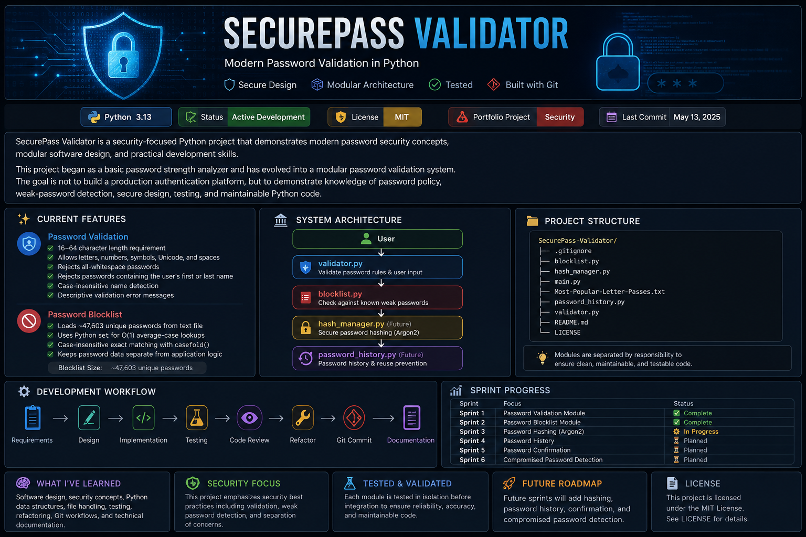

<p align="center">
  
</p>

# 🔐 SecurePass Validator

> A modular Python application that demonstrates modern password security principles, secure software design, and professional software engineering practices.

---

## 📖 Project Overview

SecurePass Validator is a portfolio project designed to demonstrate secure password validation using modern software engineering practices. Rather than serving as a complete authentication system, the project focuses on the core security concepts involved in creating and validating strong passwords.

Throughout the project, SecurePass Validator evolved from a simple password validator into a fully integrated modular application built across multiple engineering sprints. Each sprint introduced a new security feature while reinforcing principles such as modular architecture, separation of concerns, testing, documentation, Git version control, and incremental software development.

The project demonstrates practical implementations of:

- Secure password validation
- Password blocklist protection
- Argon2 password hashing
- Password history validation
- Modular application architecture
- Professional software engineering practices

Every feature was designed, implemented, tested, reviewed, refactored, documented, committed to Git, and integrated as part of a structured sprint-based development process.

---

## 🎯 Project Goals

The primary goal of SecurePass Validator is to demonstrate practical software engineering and cybersecurity skills through the development of a maintainable Python application.

This project showcases knowledge applicable to:

- 🔐 Security Engineering
- ⚙️ DevSecOps
- 🐍 Python Development
- 🛡️ Secure Authentication Concepts
- 🧪 Software Testing
- 🏗️ Software Architecture
- 🌿 Git & Version Control

Rather than focusing solely on writing code, SecurePass Validator emphasizes building software using the same iterative workflow commonly found on professional engineering teams.

---

# ✨ Features & Security Capabilities

SecurePass Validator is composed of multiple independent modules that work together to create a secure password validation workflow.

## 🔑 Password Validation

The validator enforces modern password policies by:

- ✅ Requiring passwords between **16–64 characters**
- ✅ Allowing letters, numbers, symbols, Unicode characters, and multiple spaces
- ✅ Rejecting passwords composed entirely of whitespace
- ✅ Rejecting passwords containing the user's full first name
- ✅ Rejecting passwords containing the user's full last name
- ✅ Performing case-insensitive name detection using `casefold()`
- ✅ Returning descriptive validation errors for each failed policy

---

## 🚫 Password Blocklist Protection

The blocklist module protects against commonly used weak passwords by:

- ✅ Loading **47,603** known weak passwords
- ✅ Storing the blocklist in a Python `set`
- ✅ Performing average-case **O(1)** lookups
- ✅ Using Unicode-aware normalization with `casefold()`
- ✅ Separating password data from application logic

Passwords found on the blocklist are immediately rejected before any hashing operations occur.

---

## 🔒 Argon2 Password Hashing

SecurePass Validator uses **Argon2id**, one of today's recommended password hashing algorithms.

The hashing module:

- ✅ Generates a unique random salt for every password
- ✅ Produces a different hash even for identical passwords
- ✅ Stores secure Argon2 password hashes
- ✅ Verifies plaintext passwords against stored hashes
- ✅ Never stores plaintext passwords

Hashing occurs only after every validation check has successfully completed.

---

## 📜 Password History Protection

To reduce password reuse, SecurePass Validator maintains a password history.

The history module:

- ✅ Stores previously generated Argon2 password hashes
- ✅ Detects password reuse using Argon2 verification
- ✅ Rejects previously used passwords
- ✅ Prevents users from immediately reusing old passwords

The application compares newly entered plaintext passwords against stored Argon2 hashes without exposing previously used passwords.

---

## ✅ Password Confirmation

Before a password is accepted, users must confirm it.

The application:

- ✅ Requires the confirmation password to match the original password
- ✅ Rejects mismatched confirmations
- ✅ Returns the user to the password creation workflow
- ✅ Prevents accidental password creation errors

Hashing does not occur until confirmation succeeds.

---

## 🏗️ Modular Application Architecture

SecurePass Validator follows a modular architecture in which every module performs one clearly defined responsibility.

The application consists of:

- 🖥️ `main.py` — Application orchestration and workflow control
- 🔍 `validator.py` — Name and password policy validation
- 🚫 `blocklist.py` — Weak password detection
- 📜 `password_history.py` — Password reuse prevention
- 🔒 `hash_manager.py` — Argon2 password hashing and verification

This separation of responsibilities improves readability, maintainability, and scalability while reducing duplicated code throughout the project.

---

# 🏗️ System Architecture

SecurePass Validator follows a modular architecture in which every module performs one clearly defined responsibility. Rather than placing all logic inside a single file, the application separates validation, security, and orchestration into independent components.

## Architecture Diagram

```text
                    User
                      │
                      ▼
                  main.py
          (Application Orchestrator)
                      │
      ┌───────────────┼────────────────┐
      ▼               ▼                ▼
 validator.py    blocklist.py   password_history.py
      │               │                │
      └───────────────┼────────────────┘
                      ▼
               hash_manager.py
```

The workflow executed by the application is:

```text
User Input
    │
    ▼
Name Validation
    │
    ▼
Password Policy Validation
    │
    ▼
Password Blocklist Check
    │
    ▼
Password History Check
    │
    ▼
Password Confirmation
    │
    ▼
Argon2 Password Hashing
    │
    ▼
Store Password Hash
    │
    ▼
Password Accepted
```

Each stage performs one responsibility before passing control to the next module. This design improves readability, simplifies testing, and makes the application easier to maintain as additional features are added.

The modules communicate through the application orchestrator (`main.py`) rather than directly with one another. This design reduces coupling, reinforces the Single Responsibility Principle (SRP), and makes the application easier to extend as new features are added.

---

# 📂 Project Structure

```text
SecurePass-Validator/
│
├── assets/
│   └── securepass-banner.png
│
├── archive/
│   ├── README.md
│   ├── Password_Strength_Analyzer_V1.py
│   ├── Password_Strength_Analyzer_V1_clean.py
│   ├── Password_Strength_Analyzer_V1.1.py
│   ├── Password_Strength_Analyzer_V1.1_clean.py
│   ├── Password Strength Validator Project.pdf
│   └── Password Strength Validator — Project v1.1 Notes.pdf
│
├── .gitignore
├── LICENSE
├── README.md
├── Most-Popular-Letter-Passes.txt
├── blocklist.py
├── hash_manager.py
├── main.py
├── password_history.py
└── validator.py
```

The repository is organized to separate the production-ready application from archived development versions. Earlier iterations of the project are preserved in the `archive/` directory to document the project's evolution while keeping the repository root focused on the current implementation.

---

# ⚙️ Installation & Usage

## Prerequisites

Before running SecurePass Validator, ensure the following are installed:

- Python 3.13 or later
- Git
- A Python virtual environment (recommended)

---

## Clone the Repository

```bash
git clone https://github.com/zachC89/SecurePass-Validator.git
```

```bash
cd SecurePass-Validator
```

---

## Create a Virtual Environment

### Windows (PowerShell)

```powershell
python -m venv .venv
```

Activate the virtual environment:

```powershell
.venv\Scripts\Activate.ps1
```

---

## Install Dependencies

SecurePass Validator currently requires the Argon2 password hashing library.

```bash
pip install argon2-cffi
```

---

## Run the Application

```bash
python main.py
```

The application will guide you through the password creation workflow by:

1. Collecting your first and last name
2. Validating password requirements
3. Checking the password blocklist
4. Checking password history
5. Confirming the password
6. Securely hashing the accepted password using Argon2

---

## Example Session

```text
SecurePass Validator
--------------------

Enter your first name:
Jordan

Enter your last name:
Thompson

Create a password:
River clouds drift after midnight!

Confirm your password:
River clouds drift after midnight!

Password accepted.
Your password has passed all security checks and has been securely hashed.
```

---

## Current Project Scope

SecurePass Validator is an educational portfolio project designed to demonstrate secure software engineering concepts.

At the current stage of development:

- Password history is maintained in memory during application execution.
- Password hashes are not yet stored in a database.
- User accounts and authentication are outside the project's current scope.

These limitations are intentional and keep the project focused on demonstrating secure password validation concepts rather than implementing a complete authentication platform.

---

# 🛡️ Security Concepts

SecurePass Validator was designed to reinforce modern password security concepts rather than simply validate user input.

The application currently demonstrates:

- 🔐 Secure password policy enforcement
- 🚫 Weak password detection using a password blocklist
- 🔒 Argon2id password hashing
- 📜 Password history and password reuse prevention
- 🔄 Password confirmation prior to secure storage
- 🧠 Case-insensitive Unicode-aware comparisons using `casefold()`
- 🗂️ Separation of password data from application logic
- ⚡ Efficient average-case **O(1)** password blocklist lookups using Python sets
- 🛡️ Secure password verification without storing plaintext passwords

The overall workflow mirrors the layered validation process commonly found in secure authentication systems by rejecting invalid passwords before performing computationally expensive cryptographic operations.

---

# 🏗️ Software Engineering Principles

SecurePass Validator emphasizes maintainable software architecture as much as security.

Throughout the project, the following engineering principles were applied:

- 🧩 Modular application design
- 🎯 Single Responsibility Principle (SRP)
- 🧠 Separation of Concerns
- ♻️ Code reuse through independent modules
- 🧪 Incremental testing and validation
- 👀 Structured code reviews
- 🔧 Refactoring without changing functionality
- 📖 Comprehensive documentation
- 🌿 Git version control with meaningful commit history
- 🚀 Sprint-based iterative development

Every module performs one clearly defined responsibility while `main.py` coordinates the overall application workflow.

This architecture makes the application easier to understand, maintain, test, and extend.

---

# 💡 Key Design Decisions

Several architectural decisions were made intentionally throughout development.

### Why use Python Sets for the blocklist?

Password blocklist lookups occur frequently during password validation.

Python `set` objects use hash tables internally, providing approximately **O(1)** average-case lookup performance, making them significantly more efficient than searching a list sequentially.

---

### Why keep the blocklist in a separate file?

The password blocklist represents application data rather than application logic.

Separating the two:

- Improves maintainability
- Simplifies updates
- Keeps source code cleaner
- Makes the dataset reusable

---

### Why use `casefold()` instead of `lower()`?

`casefold()` performs Unicode-aware case normalization and is more robust for security-sensitive string comparisons than `lower()`.

---

### Why hash passwords only after validation?

Argon2 is intentionally computationally expensive.

By performing validation, blocklist checks, password history checks, and password confirmation before hashing, the application avoids unnecessary cryptographic work while maintaining secure behavior.

---

### Why separate the application into multiple modules?

Each module has one responsibility:

- `validator.py` validates
- `blocklist.py` checks weak passwords
- `password_history.py` detects password reuse
- `hash_manager.py` manages Argon2 hashing
- `main.py` coordinates the workflow

This modular architecture improves readability, simplifies testing, reduces duplicated logic, and makes future enhancements easier to implement.

---

# 🧪 Testing & Development Workflow

SecurePass Validator was developed using an incremental sprint-based workflow inspired by professional software engineering practices.

Rather than implementing every feature at once, each sprint focused on a single objective that progressed through the complete software development lifecycle before moving to the next feature.

## Sprint Workflow

Every sprint followed the same engineering process:

1. 📋 Requirements Analysis
2. 🏗️ System Design
3. 💻 Implementation
4. 🧪 Module Testing
5. 👀 Code Review
6. 🔧 Refactoring
7. 📦 Git Commit
8. 🚀 GitHub Push
9. 📖 Documentation

Completing each phase before beginning the next helped maintain a stable codebase while reinforcing disciplined development practices.

---

# 🧪 Testing Philosophy

Every module was tested independently before being integrated into the complete application.

Testing focused on both expected behavior ("happy path") and failure conditions ("edge cases") to ensure each module behaved correctly before integration.

Testing included:

- ✅ Name validation
- ✅ Password policy validation
- ✅ Password blocklist validation
- ✅ Argon2 password hashing
- ✅ Password verification
- ✅ Password history validation
- ✅ Password confirmation
- ✅ Application integration
- ✅ Regression testing after refactoring

Each completed sprint concluded with regression testing to verify that new changes did not introduce unintended side effects.

---

# 🚀 Sprint Progress

| Sprint   | Feature                                 |   Status   |
|----------|-----------------------------------------|:----------:|
| Sprint 1 | Password Validation Module              | ✅ Complete |
| Sprint 2 | Password Blocklist Module               | ✅ Complete |
| Sprint 3 | Argon2 Password Hashing                 | ✅ Complete |
| Sprint 4 | Password History Validation             | ✅ Complete |
| Sprint 5 | Full Application Integration            | ✅ Complete |
| Sprint 6 | Repository Polish & Release Preparation | ✅ Complete |

---

# 🌿 Git Workflow

SecurePass Validator was developed using incremental Git commits throughout the project.

Rather than waiting until the project was finished, every sprint concluded with:

- Reviewing code changes
- Staging modified files
- Creating meaningful commit messages
- Pushing completed work to GitHub

This approach created a clear project history that documents the application's evolution from a simple password validator into a modular password validation system.

---

# 📈 Continuous Improvement

Refactoring was treated as a normal part of development rather than an indication that previous code was incorrect.

Throughout the project, improvements included:

- Optimizing blocklist loading
- Improving code readability
- Following PEP 8 formatting guidelines
- Enhancing documentation
- Simplifying application flow
- Removing duplicated code
- Strengthening module separation

Each refactor preserved existing functionality while improving maintainability and overall code quality.

---

# 📚 Development Philosophy

One of the primary goals of this project was to learn **how software is built**, not simply how to write Python code.

Throughout development, emphasis was placed on:

- Understanding why design decisions were made
- Building modular, maintainable software
- Practicing secure programming concepts
- Following professional engineering workflows
- Writing code that is easy to read, test, and extend

The project demonstrates that successful software development involves planning, testing, documentation, review, and continuous improvement in addition to implementation.

---

# 📚 Lessons Learned

SecurePass Validator became much more than a password validation project.

Throughout development, it became an opportunity to practice the complete software engineering lifecycle—from planning and implementation to testing, documentation, code reviews, refactoring, and version control.

Some of the most valuable lessons learned during the project include:

- Building modular applications is easier to maintain than placing all logic in a single file.
- Small, incremental improvements produce cleaner software than attempting to build everything at once.
- Secure software design is about making thoughtful architectural decisions, not just writing secure code.
- Password hashing, validation, and storage each solve different security problems and should remain separate responsibilities.
- Documentation, testing, and Git history are just as important as the source code itself.
- Refactoring is a normal part of software development and improves maintainability without changing application behavior.

Perhaps the biggest lesson was realizing that software engineering is not simply about writing code—it's about designing systems that are understandable, maintainable, testable, and secure.

---

# 🚀 Roadmap (Post-v1.0)

Although SecurePass Validator successfully demonstrates modern password validation concepts, there are many opportunities for future expansion.

Potential future enhancements include:

### 🔐 Authentication Improvements

- Persistent password history using a database
- Multi-user account support
- Secure user registration
- User login workflow
- Password expiration policies

---

### 🛡️ Security Enhancements

- Password breach detection using the Have I Been Pwned API
- Configurable password policies
- Password strength estimation
- Audit logging
- Rate limiting for authentication attempts

---

### 🏗️ Application Improvements

- Configuration file support
- Command-line arguments
- Graphical User Interface (GUI)
- REST API implementation
- Automated unit testing
- Continuous Integration (CI) pipeline
- Docker containerization

---

### 📈 Long-Term Goal

The long-term goal of SecurePass Validator is not to become a production authentication platform, but to continue serving as a practical learning project that demonstrates growth in secure software engineering, Python development, and cybersecurity principles.

As new skills are learned, the project can continue evolving while preserving its modular architecture and maintainable design.

---

# 📄 License

This project is licensed under the **MIT License**.

See the [LICENSE](LICENSE) file for additional information.

---

# 👨‍💻 About This Project

SecurePass Validator was developed as a portfolio project to strengthen practical skills in secure software engineering, Python development, and software architecture.

The project emphasizes learning through iterative development, with each feature planned, implemented, tested, reviewed, documented, and integrated as part of a structured engineering workflow.

Rather than demonstrating only the final application, this repository documents the complete development process and the engineering decisions made throughout the project.